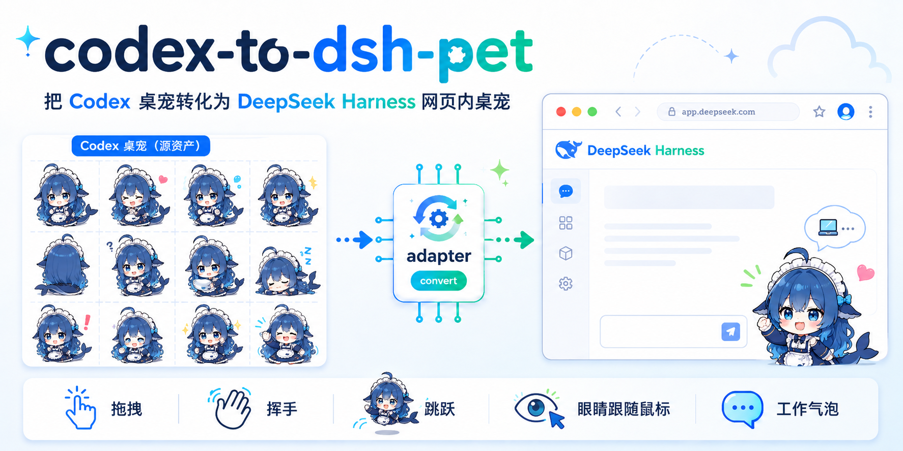

🌐 [中文](README.md) · **English**

# codex-to-dsh-pet



A generic framework / adapter that ports **Codex desktop pets** (spritesheet atlas) into **DeepSeek Harness (DSH)** web-GUI pets.
This project is written with DSH — if you find any bugs or errors, please let us know; we keep iterating.

- Zero-dependency core renderer (pure DOM, no build step)
- Ready-to-use interactions: drag (runs in the direction of movement), hover to wave, double-click to jump, eyes follow the mouse (note: only Codex pet **v2** atlases — 11 rows — support eye tracking)
- Reacts to the agent's live activity state and switches poses
- **Progress bubble** above the pet while working (tool name / streaming text / "thinking…")
- Per-row **size normalization** to fix inconsistent pose sizes in some atlases

> ⚠️ This framework does **not** include any pet artwork. You must provide your own
> spritesheet with legitimate usage rights — see [LEGAL.md](./LEGAL.md).

## Quick Start

### Minimal install (for absolute beginners)

**Before you start you need two things**: ① [Node.js](https://nodejs.org/) installed (to run `node`); ② a working DeepSeek Harness (DSH) installation.

**Step 1: Get the code**

- Click the green **Code → Download ZIP** button on the repo page, download and **unzip** it to get a `codex-to-dsh-pet` folder;
- Or clone from the command line: `git clone https://github.com/Signalight/codex-to-dsh-pet.git`

**Step 2: Open PowerShell (in the right place)**

1. Open the extracted `codex-to-dsh-pet` folder in File Explorer;
2. Hold **Shift** and **right-click** on the **empty area** of the folder;
3. Choose **"Open PowerShell window here"** from the menu (Windows 11 may say "Open in Terminal" — same thing).

If the prompt shows `...\codex-to-dsh-pet`, you're in the right place.

**Step 3: Drop in your spritesheet**

Rename your pet spritesheet (`.webp` image) to whatever you want to call your pet (e.g. `big-blue-fish.webp`), then **drag it into** the `codex-to-dsh-pet` folder.

**Step 4: Run two commands**

Type the two commands below one by one, **pressing Enter after each**:

```powershell
node build.js
```

```powershell
.\install-to-dsh.ps1
```

When you see `Done.` it worked.

**Step 5: Restart and refresh**

Restart `dsh web`, then **hard-refresh** `http://127.0.0.1:3080` in your browser (`Ctrl+Shift+R`). Your pet appears in the bottom-right corner 🎉

> **Common errors**:
> - "Running scripts is disabled..." → first run `Set-ExecutionPolicy -Scope CurrentUser RemoteSigned` (press `Y`), then redo Step 4.
> - "`node` is not recognized..." → Node.js isn't installed; grab it at [nodejs.org](https://nodejs.org/).
> - Want to switch between multiple pets? Use `.\select-pet.ps1` (see below).

---

### 1. Prepare the artwork

Name a Codex pet spritesheet **after your pet** (e.g. `fluffy.webp`) and place it in this directory.
The plugin name is derived from the filename automatically — one spritesheet = one plugin.

### 2. Configuration (optional)

`name` / `label` are **not required** (derived from the spritesheet filename automatically). Only create `config.json` when you need to change size, normalization, bubble texts, etc.:

```powershell
Copy-Item config.example.json config.json
```

`config.json` fields (`name` / `label` optional; default to the spritesheet filename):

| Field | Description | Default |
|---|---|---|
| `name` | Plugin name (also the node_modules dir / registration name) | **spritesheet filename** |
| `label` | Label shown on the overlay | **spritesheet filename** |
| `spritesheetPath` | Relative path to the spritesheet | auto-detected |
| `spriteVersionNumber` | Atlas version: `1` (8×9) or `2` (8×11, includes look frames) | **auto-detected** (1872/2288 px) |
| `size` | Display width in px | `120` |
| `pin` | Initial position (`bottom-right` / `bottom-left` / …) | `bottom-right` |
| `normalize` | Optional per-row size normalization `[null, …, { s, cx, cy }, …]` | none |
| `look.enabled` | Enable "eyes follow mouse"; set `false` for old pets (no look frames) | `true` |
| `look.deadzone` | Look deadzone (px; no tracking when the pointer is closer than this) | `28` |
| `bubble.enabled` | Show the progress bubble | `true` |
| `bubble.maxChars` | Max length of streamed text | `140` |
| `bubble.runningText` | Text while a tool runs (`{tool}` is replaced with the tool name) | `Running: {tool}…` |
| `bubble.workingText` | Text while working without a tool name | `Working…` |
| `bubble.thinkingText` | Text while thinking | `Thinking…` |

> 💡 **Version auto-detection**: build.js detects v1/v2 from the atlas dimensions — height **1872px = v1** (9 rows, no look frames, mouse tracking off), height **2288px = v2** (11 rows, 16-direction look frames, mouse tracking on). So you generally **don't need to set `spriteVersionNumber` manually**; only set it explicitly when your atlas isn't a standard size.

### 3. Build

```powershell
node build.js
```

It auto-detects the atlas, derives the pet name from the filename, and generates the self-contained `lib/client.js` and `config.effective.json`.

To build **one specific atlas**, use the one-command shortcut (writes `config.json` + runs `build.js`):

```powershell
.\build-pet.ps1 big-blue-fish                               # name must match the atlas filename
.\build-pet.ps1 big-blue-fish -NodePath C:\path\to\node.exe # optional: explicit node path
```

You can run a smoke test to verify the build output:

```powershell
node verify-bundle.cjs
```

### 4. Install into DSH

```powershell
.\install-to-dsh.ps1
```

The script locates your DSH home automatically, copies the plugin to `<DSH home>/profiles/node_modules/<name>`, and registers it in `<DSH home>/profiles/web/cordis.patch.yml` (idempotent, auto-backup).

> **DSH home detection** (shared by `install-to-dsh.ps1` / `select-pet.ps1`, in order):
> 1. `$env:DSH_HOME` (wins if set);
> 2. `~/.dsh` (command-line dsh's usual location, used if it exists);
> 3. `%APPDATA%\io.github.hairyf.deepseek-harness-desktop\data\dsh`
>    (DeepSeek Harness **desktop app**'s data directory).
>
> Command-line users are usually at `~/.dsh`; desktop-app users at `%APPDATA%\...\data\dsh`.
> Note: the desktop app does **not** export `DSH_HOME` to your terminal — the scripts find it via the probe above.
> The detection logic lives in `dsh-home.ps1` (shared by the install/select scripts); edit that file to customize.

### 5. Restart and refresh

```powershell
dsh web
```

Then hard-refresh `http://127.0.0.1:3080` in your browser (`Ctrl+Shift+R`) — the pet appears in the bottom-right corner.

### 6. Choose which pets are active

After installing multiple pets, use `select-pet.ps1` to toggle which ones are active:

```powershell
.\select-pet.ps1          # interactive menu: type a number to toggle, q to save & quit
.\select-pet.ps1 -List    # just show the current state, no changes
```

It scans node_modules for all pet plugins (`dsh.client` packages), shows their active state, and writes your choices back to `cordis.patch.yml` (auto-backup). Restart `dsh web` + hard-refresh to apply.

## Atlas format

Codex pet atlases are fixed-layout sprite sheets:

| Item | Value |
|---|---|
| Frame size | 192 × 208 px |
| Columns | 8 |
| v1 rows | 9 (1536 × 1872) |
| v2 rows | 11 (1536 × 2288; rows 9–10 are the 16-direction look frames) |

Per-row animations (frame interval ms):

| Row | Animation | Frames | Interval |
|---|---|---|---|
| 0 | idle | 6 | 160 |
| 1 | runningRight | 8 | 120 |
| 2 | runningLeft | 8 | 120 |
| 3 | waving | 4 | 140 |
| 4 | jumping | 5 | 140 |
| 5 | failed | 8 | 140 |
| 6 | waiting / sleeping | 6 | 150 |
| 7 | running | 6 | 120 |
| 8 | review | 6 | 150 |
| 9–10 | look (16 directions) | 16 | — |

## Directory layout

```
.
├── config.example.json     # example configuration
├── build.js                # inlines atlas + config → lib/client.js (name from atlas filename)
├── verify-bundle.cjs       # build smoke test
├── build-pet.ps1           # one-command build for a named pet (optional -NodePath)
├── dsh-home.ps1            # shared DSH home detection (used by install/select)
├── install-to-dsh.ps1      # one-click install
├── select-pet.ps1          # choose which pets are active
├── lib/
│   ├── index.js            # host (Node) half
│   ├── client.template.js  # browser half source template
│   └── client.js           # build output (generated by build.js, gitignored)
├── LEGAL.md                # copyright & licensing notes
└── LICENSE
```

## Rollback

```powershell
# Reuse the same DSH home detection as the install script (dsh-home.ps1)
. .\dsh-home.ps1
$profileDir = Join-Path (Get-DshHome) 'profiles\web'
$nodeModules = Join-Path (Split-Path -Parent $profileDir) 'node_modules'

Remove-Item -Recurse -Force (Join-Path $nodeModules '<name>')
Copy-Item "$profileDir\cordis.patch.yml.bak" "$profileDir\cordis.patch.yml" -Force
# then restart dsh web
```

## Changelog

- **2026-08-17** Added an English README (`README.en.md`) with a language switcher at the top; added a repository description on GitHub.
- **2026-08-17** Docs: example pet name unified to the fictional `big-blue-fish`; no longer uses the game character name `anaxa`.
- **2026-08-17** Refactor: DSH home detection extracted into shared `dsh-home.ps1` (used by the install/select scripts and the README rollback snippet); `build-pet.ps1` gained `-NodePath`, no longer depending on the author's machine path; `select-pet.ps1` now preserves comments and non-pet patch entries on save, matching `install-to-dsh.ps1`.
- **2026-08-16** Fix: `build.js` auto-detection ignores the repo's own `banner.png`; `install-to-dsh.ps1` / `select-pet.ps1` support the three-level `DSH_HOME` probe (`$env:DSH_HOME` → `~/.dsh` → desktop app `%APPDATA%\...\data\dsh`); `install-to-dsh.ps1` drops the `[]` placeholder when writing the patch, fixing invalid YAML in generated `cordis.patch.yml`.
- **2026-08-16** Fix: loading multiple pets at once no longer errors (template top-level `const` wrapped in an IIFE); several pets can now be enabled simultaneously.
- **2026-08-16** `build.js` auto-detects v1/v2 from atlas dimensions (height 1872px = v1, 2288px = v2); v2 enables mouse tracking automatically — no need to fill in `spriteVersionNumber`.
- **2026-08-16** Pet name auto-derived from atlas filename (one atlas = one plugin); stale `spritesheetPath` falls back automatically; new `select-pet.ps1` for toggling active pets.
- **2026-08-15** Fixed the install script's UTF-8 encoding and directory-creation issues; added `look` config (v1 pets can disable eye tracking); README gained the "minimal install" section.
- **2026-08-15** Initial release: generic framework (renderer + DSH adapter + progress bubble + drag / hover wave / double-click jump / eyes-follow + per-row size normalization).

## License & copyright

Plugin code is licensed under [MIT](./LICENSE). For copyright notes about Codex pet artwork/format, see [LEGAL.md](./LEGAL.md).

## Acknowledgements

Thanks to @tuskinekinase for inspiration and encouragement ~
